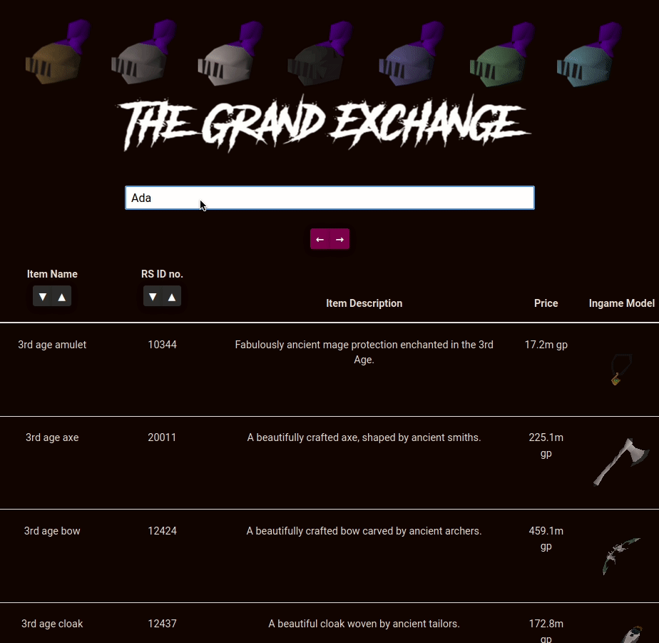
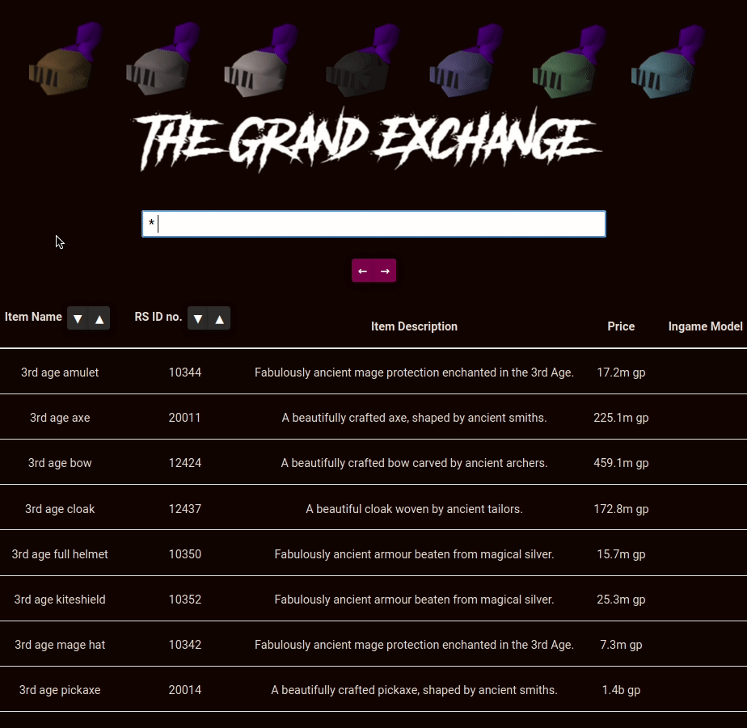

# FastGE
An application that features a dynamically sized table created in ReactJS which can perform a fast query on OSRS Grand Exchange items, which are stored in a Firebase instance. 

## How can I use it?
First, execute an `npm install` in the project root directory to install all dependencies. 

Next, you'll want to setup a Firebase DB so head on over to [Firebase](https://firebase.google.com) and create a project. Then, obtain a copy of the .json containing your firebase credentials. Rename the file to `firebase_credentials.json` and place it in `src/db_local/`.

Lastly, create a file in `src/db_local/` named `config.js` and copy/paste the following:
```
const db_url = "YOUR_DB_URL"
exports.db_url = db_url;
```

where YOUR_DB_URL is the URL obtained from your Firebase console.

You can then run the script `refresh_ge_entry.sh` located in `src/db_local/rs_api/` to populate your Firebase DB with current OSRS Grand Exchange values.

You should be good to go at this point if your DB is being populated with values. Finally, run the app with `npm start`.

## Technologies Used
- React JS
- Google Firebase
- Shell

## Demo




